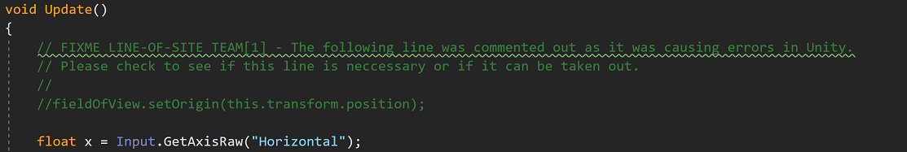
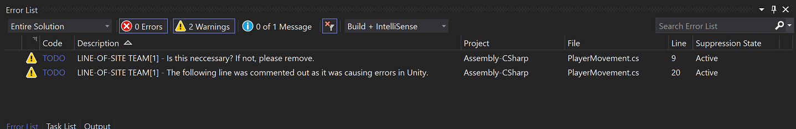
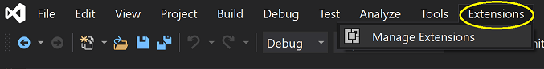
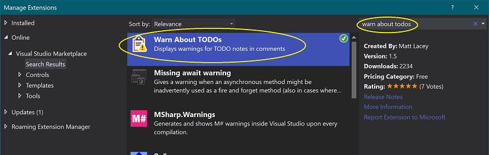
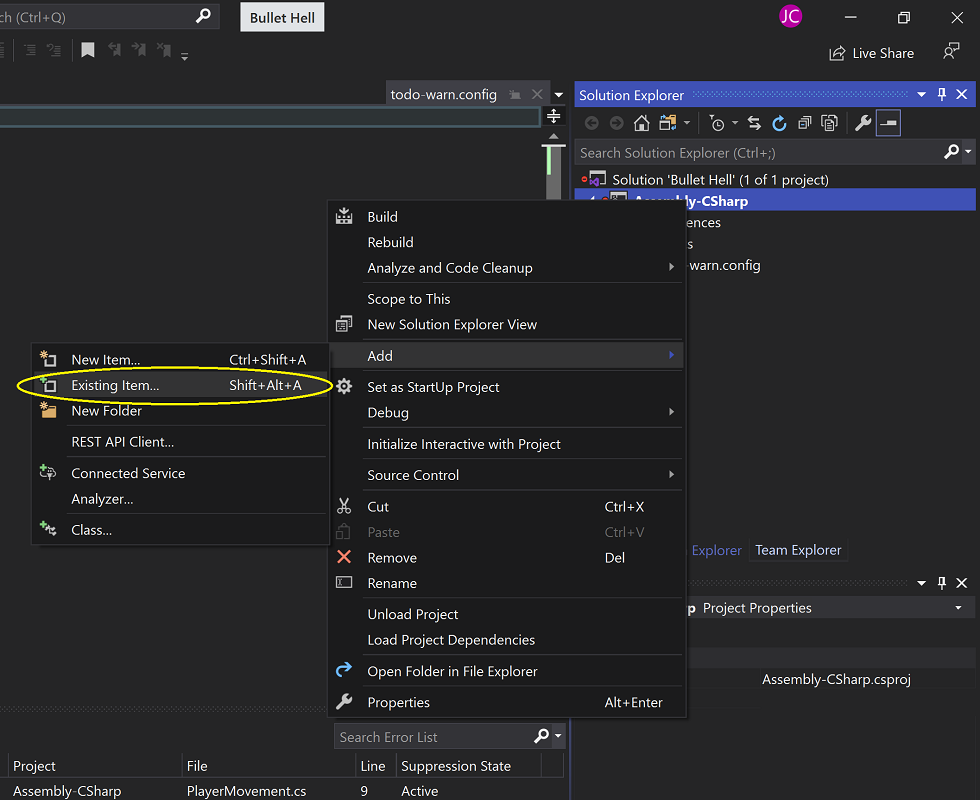
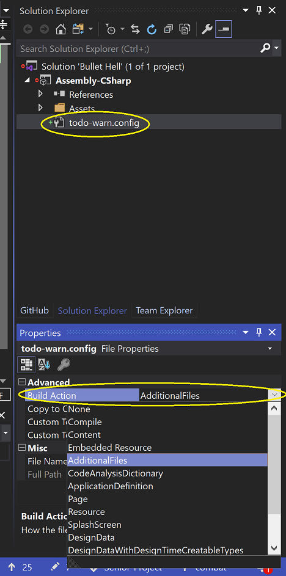

# Senior-Project
A 2D Bullet Hell game in Unity.

## Development

* **[Unity 2020.1.4](https://unity3d.com/unity/whats-new/2020.1.4)** Unity’s real-time 3D development platform lets artists, designers and developers work together to create amazing immersive and interactive experiences. (Available for Windows, Mac, and Linux.)

* **[Visual Studio Community 2019](https://visualstudio.microsoft.com/vs/community/)** A fully-featured, extensible, free IDE for creating modern applications for Android, iOS, Windows, as well as web applications and cloud services.

* **[Visual Studio - Extension: Warn About TODO's](https://github.com/mrlacey/WarnAboutTodos)**  Visual Studio automatically takes code comments that include `TODO` and turns them into User Tasks that are displayed on the Task List. This takes those same tasks and also creates warnings for them. 

  * This extension will allow us to quickly view and access commented tags such as "FIXME" and "TODO". 

  * Add this extension via the Visual Studio Menu Bar. 

  * **Extensions** > **Manage Extensions** 

  * Search for "Warn About TODOs" and Install

  * Once the extension has been installed and you have restarted Visual Studio, add the configuration file by opening the Unity Project in Visual Studio > right-clicking on the project in the Solution Explorer > Add > Existing Item

  * Select the "todo-warn.config" file and click Add
  
  * Once added, select the "todo-warn.config" file in the Solution Explorer and set the "Build Action" to "AdditionalFiles"

